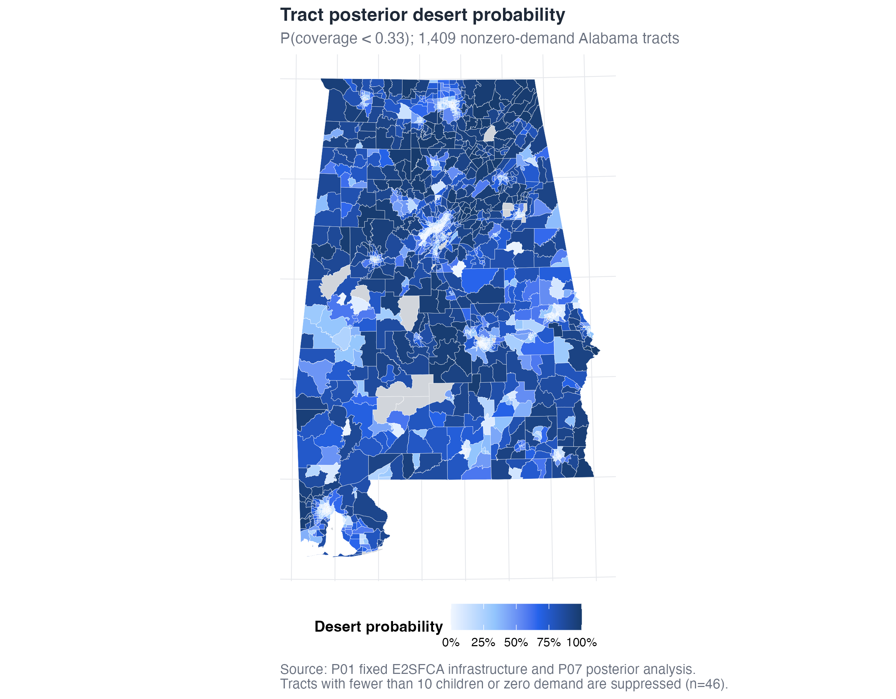

# Posterior propagation and desert probability {#sec-posterior}

The previous chapter (@sec-model) fit a single Bayesian spatial model of child
care coverage. That fit gives us a smoothed latent field and its uncertainty,
but it is not yet an answer to the question a policymaker actually asks: *how
sure are we that this tract is a child care desert?* This chapter builds the
bridge. We take the one fitted model, fold in the two input-uncertainty streams
prepared in @sec-inputs, and turn each tract into a **posterior desert
probability** — a number between 0 and 1 that says how much of the evidence
points to inadequate access. That probability, and the ranking quantity derived
from it, are the raw material for the error-controlled declarations in
@sec-declarations.

Two scripts in the pipeline (@sec-overview) do the work, in order:

- `scripts/02-2_posterior_draws.R` — combine the fit with the input draws into
  2,000 joint coverage draws per tract (Step 2.2).
- `scripts/02-3_desert_probability.R` — reduce those draws to a desert
  probability and a local index of significance for each tract (Step 2.3).

Throughout, "coverage" means the accessibility ratio $\rho_t$ for tract $t$:
accessible child care slots per child under five. A tract is a desert when
coverage falls below an adequacy threshold; the companion deterministic desert
study ("P01") set that threshold at $0.33$ slots per child, and we keep it
(@sec-inputs).

## From one fit to a joint posterior

We do not refit the model 2,000 times. We fit it **once** and then draw from the
joint posterior of everything that feeds coverage. For draw $s$ and tract $t$,

$$
\rho_t^{(s)} \;=\; \lambda_t^{(s)} \;\times\; \frac{\hat D_t}{D_t^{(s)}} \;\times\; \kappa_t^{(s)},
$$

and each of the three factors carries one source of uncertainty:

- $\lambda_t^{(s)}$ is a **latent coverage-rate draw** from the fitted BYM2
  model — the model's smoothed estimate of slots-per-child for the tract, drawn
  from its posterior so that spatial and estimation uncertainty come along.
- $\hat D_t / D_t^{(s)}$ is the **demand ratio**. $\hat D_t$ is the fixed
  expected number of children under five (the ACS point estimate), and
  $D_t^{(s)}$ is a **truncated-normal demand draw** that reflects the ACS margin
  of error. Because demand sits in the denominator of a coverage rate, a smaller
  drawn demand inflates coverage and a larger one deflates it; the ratio
  transmits census sampling error into $\rho$.
- $\kappa_t^{(s)}$ is the **capacity ratio**, the drawn tract capacity divided by
  its expected capacity, carrying the provider-side supply uncertainty.

The three streams are drawn with **three independent, seeded RNG streams** so
that the sources of error do not accidentally line up:

```r
# scripts/02-2_posterior_draws.R
seed_latent <- 20260716L   # BYM2 latent posterior samples
seed_demand <- 20260717L   # truncated-normal demand draws
seed_supply <- 20260718L   # drawn/expected capacity ratios
```

The latent factor is the delicate one, because it comes from `INLA`. We draw it
with `sample_predictors_batched()` (`R/fct_bym2.R`), which calls
`INLA::inla.posterior.sample()` [@rue_approximate_2009] in **20 batches of 100**
to reach the 2,000
draws. Batching is not cosmetic: `INLA` documents that reproducibility requires
resetting *both* R's RNG and its own internal seed, so each batch resets both to
a batch-specific seed and forces serial execution
(`num.threads = "1:1"`, `parallel.configs = FALSE`). The result is a set of
latent draws that is identical on every machine, not merely identical in
distribution.

```r
# schematic of the batched latent sampler (R/fct_bym2.R)
for (b in seq_along(starts)) {
  batch_seed <- as.integer(seed + b - 1L)
  set.seed(batch_seed)                       # reset R's RNG
  samples <- INLA::inla.posterior.sample(    # reset INLA's seed too
    n_in_batch, fit, seed = batch_seed, num.threads = "1:1"
  )
  # ... collect the linear predictor for the eligible tracts ...
}
```

The demand and capacity factors are lighter. `draw_truncated_demand()`
(`R/fct_uncertainty.R`) draws each tract's under-five count from a normal
centered on the ACS estimate with the ACS-derived standard error, **truncated at
one child** for eligible tracts — a positive-count support that keeps the
inverse-demand multiplier finite (a mathematically necessary domain correction,
recorded in `outputs/tables/02_model_deviation_register.csv`).
`draw_capacity_rates()` produces the drawn capacity rates, and we divide by the
fixed expected rate to form $\kappa$.

One special case matters for honesty about coverage in empty places. Of the
1,409 analyzed tracts, **203 have a structural-zero expected capacity** — no
modeled supply reaches them under the fixed access geometry. For these tracts we
set $\kappa_t^{(s)} = 1$ for every draw, so the capacity factor contributes no
spurious spread, and we let the BYM2 latent field supply their spatial posterior
uncertainty. The alternative — dividing by an expected rate of zero — is
undefined, so this is the only defensible convention.

Putting the three factors together element by element gives the full draw matrix
$\rho^{(s)}_t$: 1,409 tracts by 2,000 draws. That object is the joint posterior
of coverage. The raw matrix is large and is written only to an ignored interim
location (`data/interim/`); everything downstream reads either it or the tract
summaries derived from it.

## Modular (cut) propagation, and what it does and does not do

We want to be plain about the design, because it is a deliberate choice with a
real cost. The input draws **rescale the fitted field**; they do not trigger a
per-draw model refit. In the language of Bayesian workflow this is a *modular*
or *cut* propagation: information flows from the input models into coverage, but
not back into the smoothing model. Each demand or capacity draw multiplies the
already-fitted latent rate rather than changing what that rate would have been.

Why we chose it:

- **Tractability.** A full joint refit would mean re-estimating the spatial
  model thousands of times. Modular propagation needs one fit and a matrix
  multiply, which keeps the whole pipeline runnable on an ordinary machine and,
  just as important, **auditable** end to end.
- **A fixed access geometry.** The E2SFCA access geometry — who can reach which
  providers — is treated as fixed infrastructure. We propagate uncertainty in
  *how many* children and slots there are, not in the travel-and-catchment
  structure that defines accessibility. Holding that structure fixed is a
  modeling commitment we make openly.

And the limitation, stated just as plainly: modular propagation **understates
the interaction between input error and spatial smoothing**. If a demand draw
were fed back through the model, neighboring tracts would borrow strength from
it and the smoothed field would shift; by rescaling instead, we hold the
smoothing fixed and therefore miss that second-order coupling. Our intervals are
best read as capturing the first-order transmission of input error through a
fixed spatial estimate, not the full joint uncertainty of a refit-every-draw
model. Readers who need the latter should treat these probabilities as a
well-characterized, reproducible lower bound on uncertainty rather than the last
word.

Because rescaling can, in principle, drift away from the fit it started from, we
check alignment explicitly. The mean latent draw should track the model's fitted
coverage rate almost perfectly:

```r
# scripts/02-2_posterior_draws.R
latent_mean      <- rowMeans(latent_rate)
latent_alignment <- cor(latent_mean, model_data$fitted_rate_mean,
                        method = "spearman")
stopifnot(latent_alignment > 0.98)
```

The realized Spearman correlation is $\approx 1.000$ (0.99987), confirming that
the joint draws are anchored to the fit rather than wandering from it. The script
stops if that guarantee ever fails.

## Desert probability and the local index of significance

With the joint draws in hand, the desert question becomes a counting exercise.
Fix the adequacy threshold at $A - \gamma$, where $A = 0.33$ is the adequacy
level and $\gamma = 0$ is the primary buffer (both preregistered; see
@sec-inputs). For each tract, the **posterior desert probability** is the
fraction of draws that fall below the threshold:

$$
p_t \;=\; \Pr\!\left(\rho_t < A - \gamma \,\middle|\, \text{data}\right)
      \;=\; \frac{1}{S}\sum_{s=1}^{S} \mathbf{1}\!\left\{\rho_t^{(s)} < A - \gamma\right\},
$$

with $S = 2{,}000$ draws.

```r
# scripts/02-3_desert_probability.R
threshold          <- A - gamma                 # 0.33 - 0 = 0.33
desert_indicator   <- draws$rho_draws < threshold
desert_probability <- rowMeans(desert_indicator)
lis                <- 1 - desert_probability
```

Two consequences of using 2,000 draws are worth internalizing. First, the
**resolution** of $p_t$ is $1/2000 = 0.0005$: probabilities land on a grid of
half-thousandths, and we report them as such. Second, **no tract reaches exactly
0 or 1** — every tract has at least one draw on each side of the threshold, so
the probabilities are genuinely interior. That is a feature: it means no tract is
ever declared a certainty in either direction on the strength of a finite sample.

The ranking quantity is the **local index of significance** (LIS),

$$
\ell_t \;=\; 1 - p_t,
$$

the posterior probability that the tract is **not** a desert
[@richardson_interpreting_2004]. A small $\ell_t$ is strong evidence *for* being
a desert, so sorting tracts by ascending $\ell_t$ orders them from most to least
compelling. This is exactly the quantity the declaration procedures in
@sec-declarations rank on; introducing it here, as a simple transform of the
desert probability, is what lets those procedures control a false-discovery
criterion.



Figure F1 maps $p_t$ across Alabama. The story it tells is that desert status is
a **gradient**, not a border. Many tracts sit at intermediate probabilities,
and the map's job is to show where the evidence is strong, where it is weak, and
where it is genuinely uncertain — which is precisely what the next section
quantifies.

## RQ1: how much uncertainty, and where it bites

Our first research question is descriptive: once we take the input error
seriously, how much uncertainty is there in desert status, and which tracts
carry it? The joint posterior lets us answer both parts.

**The central tendency already signals scarcity.** The median tract's
posterior-median coverage is **0.275 slots per child** — below the 0.33 adequacy
line — and the median tract's desert probability is **0.611**. In other words,
the typical Alabama tract is more likely a desert than not, and the deterministic
picture of widespread scarcity survives the move to a probabilistic one.

**But the confidence is very unevenly distributed.** Reading the desert
probability at increasing confidence screens thins the map quickly:

| Probability screen | Tracts |
|---|---:|
| $p > 0.50$ (more likely desert than not) | 816 |
| $p > 0.90$ (high confidence) | 280 |
| $p > 0.95$ (very high confidence) | 152 |

So while 816 tracts are on the desert side of even money, only 152 clear a
0.95 bar. The gap between those numbers *is* the uncertainty, and it is why a
single threshold on the probability map is not yet a defensible decision rule
(the subject of @sec-declarations).

**A large ambiguous middle.** The band $0.25 \le p_t \le 0.75$ — tracts where the
evidence is closest to a coin flip — holds **517 tracts (36.7%)**. More than a
third of the analyzed universe is genuinely undecided. Any procedure that forces
a binary map is making a hard call on those 517 tracts whether it admits it or
not.

**Where the ambiguity concentrates.** We preregistered a split on the ACS demand
coefficient of variation (CV), the noisiness of the census under-five count.
Tracts with $\text{CV} > 0.40$ are the **high-CV stratum** (605 tracts); the rest
form the **low-CV stratum** (804 tracts). The ambiguous band is markedly heavier
in the noisy stratum:

| Stratum | Tracts | Ambiguous ($0.25$–$0.75$) | Median relative 95% interval width |
|---|---:|---:|---:|
| High-CV ($\text{CV} > 0.40$) | 605 | 42.1% | 6.71 |
| Low-CV ($\text{CV} \le 0.40$) | 804 | 32.6% | 3.11 |

The right-hand column is the sharpest summary. The **relative width** of a
tract's 95% posterior coverage interval — its width divided by its posterior
median — is a scale-free measure of how uncertain that tract's coverage is. The
median high-CV tract has a relative interval width of **6.71**, more than twice
the low-CV median of **3.11**. Demand noise, in other words, propagates straight
through to wider coverage intervals and a fuzzier desert call, exactly where the
census itself is least sure. This is the concrete payoff of propagating input
error rather than ignoring it: it tells us *which* tracts we should trust least.

Every number in this section is reproducible from the shipped tract table
`data/derived/tract_results.csv`, one row per analyzed tract. The relevant
columns are `desert_probability` and `LIS` (the two headline quantities),
`coverage_median` (the posterior-median coverage), and `width95` /
`relative_width95` (the absolute and scale-free interval widths). The stratum
flag is `high_cv_flag`, and `cv_under5` holds the underlying CV. The dictionary
`data/derived/tract_results_dictionary.csv` documents every column.

## What this produces

Running Steps 2.2 and 2.3 yields:

- **Analytic objects** (internal to Track A): `02_coverage_posterior.rds` with
  the per-tract coverage summaries, the large joint draw matrix in
  `data/interim/02_coverage_posterior_draws.rds`, and `02_desert_probability.rds`
  with the desert probabilities and LIS.
- **The shipped tract table** `data/derived/tract_results.csv` (with its
  dictionary), which carries `coverage_median`, `width95`, `relative_width95`,
  `desert_probability`, and `LIS` for every analyzed tract — enough to reproduce
  all of the RQ1 numbers without the restricted inputs.
- **Diagnostic tables** `outputs/tables/02_posterior_diagnostics.csv` (the
  latent–fitted Spearman check, median coverage, and the interval-width summaries
  by stratum), `outputs/tables/02_desert_probability_summary.csv` (the
  probability screens), and `outputs/tables/02_probability_ambiguity_by_cv.csv`
  (the ambiguity split).
- **Figure F1**, `outputs/figures/F1_desert_probability.png` (rebuilt by Track C
  into `results/figures/`), the posterior desert probability map shown above.

With a desert probability and a ranking index for every tract, we are ready to
turn probabilities into decisions. @sec-declarations does that, converting the
LIS into error-controlled declarations at preregistered levels.
