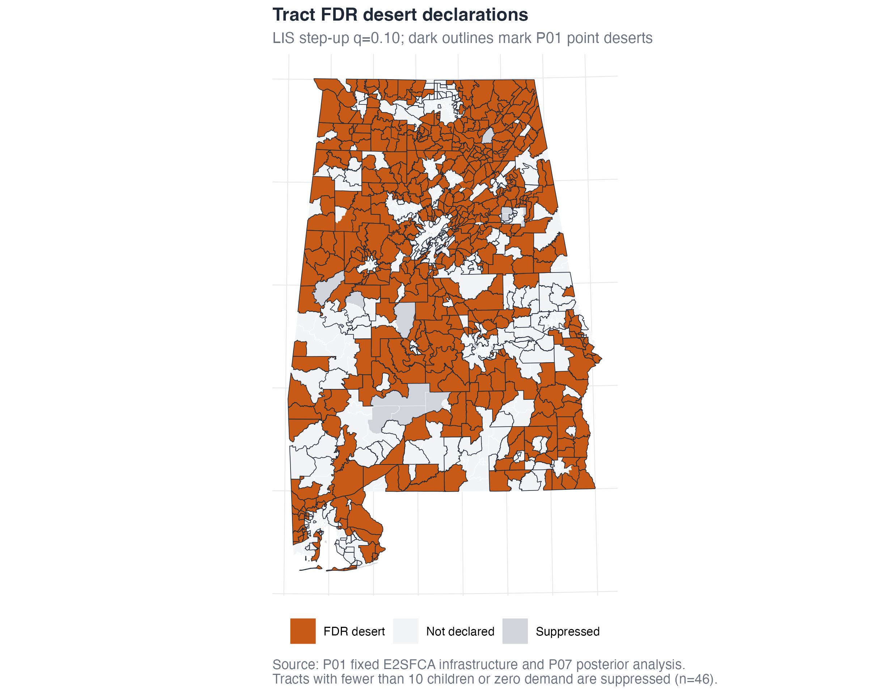

# Error-controlled declarations {#sec-declarations}

@sec-posterior gave every tract a posterior desert probability $p_t$ and a
ranking index $\ell_t = 1 - p_t$ (the local index of significance, LIS). This
chapter turns those probabilities into **declarations**: explicit lists of
tracts and counties we are willing to call deserts, each list controlling a
stated false-discovery criterion at a level we fixed in advance. This is where a
probability map becomes a decision system.

Four scripts carry the argument:

- `scripts/03-1_sun_fdr.R` — the three primary declarations: tract FDR, tract
  FDX, and county-level declarations (Step 3.1).
- `scripts/03-2_compare_p01.R` — cross-classify the FDR declarations against the
  deterministic desert map from the companion study, "P01" (Step 3.2).
- `scripts/03-3_sensitivity.R` — preregistered sensitivity analyses and
  triangulation against P01's stability anchor (Step 3.3).

The selection arithmetic lives in one small, tested helper, `R/fct_fdr.R`, so
that every procedure below reads from the same code.

## Why declaration, not thresholding

It is tempting to stop at the probability map and tell a policymaker "act where
$p_t > 0.9$." The problem is that a threshold on a map controls nothing you can
name. If you draw the line at 0.9 across 1,409 tracts, you have no statement
about how many of the tracts you flagged are mistakes — the expected number of
false flags depends on the whole distribution of probabilities, not on the cut
point alone. A threshold answers "which tracts clear a bar?"; it does not answer
"if I act on this whole list, what error am I accepting?"

Multiple-testing declaration procedures answer the second question directly. We
choose an error criterion — the **false discovery rate**
[@benjamini_controlling_1995] (the expected fraction
of declared deserts that are not deserts), or the stricter **false discovery
exceedance** (the probability that fraction runs high) — fix its level *before*
looking at the counts, and then let the data pick the largest list consistent
with that guarantee. The output is not a prettier map; it is a list with a
warranty.

## Tract FDR: the LIS step-up

Our primary tract declaration is the LIS step-up procedure of
@sun_false_2015. Its logic is elegant. Sort tracts by ascending $\ell_t$, so the
strongest desert evidence comes first. Walk down the sorted list; at position
$k$, the running mean of the LIS values,

$$
\overline{\ell}(k) \;=\; \frac{1}{k}\sum_{i \le k} \ell_{(i)},
$$

is an estimate of the false discovery rate you would incur by declaring the top
$k$ tracts — because each $\ell_{(i)}$ is exactly the posterior probability that
tract $(i)$ is *not* a desert, and averaging those probabilities over the
declared set estimates the expected non-desert fraction in it. Declare the
**largest** prefix whose running mean stays at or below the target $q$:

$$
k^{*} \;=\; \max\Bigl\{k : \overline{\ell}(k) \le q\Bigr\}.
$$

The helper implements exactly this:

```r
# R/fct_fdr.R
lis_step_up <- function(lis, q = 0.10) {
  ordering        <- order(lis, seq_along(lis))   # ascending LIS
  sorted          <- lis[ordering]
  cumulative_mean <- cumsum(sorted) / seq_along(sorted)
  valid           <- which(cumulative_mean <= q)  # prefixes meeting the target
  k               <- if (length(valid)) max(valid) else 0L
  # ... return the selected tracts, k, and the achieved mean LIS ...
}
```

At the preregistered target $q = 0.10$, the step-up declares **512 tracts**. The
achieved mean LIS across those 512 tracts is **0.099991** — just under the 0.10
target, as the step-up guarantees, because taking one more tract would push the
running mean above 0.10. So we can state the warranty precisely: of the 512
tracts declared, the expected fraction that are not truly deserts is at most
about 10%.



Figure F2 maps the 512 declared tracts, shaded by their position in the
selection path. The full path — every prefix's sorted LIS and running mean — is
shipped in `data/derived/fdr_path.csv` (columns `rank`, `LIS`,
`cumulative_mean_LIS`), so you can see the exact point at which the running mean
crosses 0.10 and the declaration stops.

## Tract FDX: controlling the exceedance

The FDR controls the false discovery rate *on average*. But an average can hide
a bad tail: a procedure can hold the mean at 0.10 while, on some draws of the
posterior, the realized false-discovery proportion runs much higher. When the
cost of over-declaring is real — dollars committed to tracts that turn out
adequate — we want a guarantee about that tail. That is **false discovery
exceedance** (FDX) control [@genovese_stochastic_2004;
@lehmann_generalizations_2005].

We compute it inside the FDR prefix, using the joint posterior draws directly.
For a candidate prefix of size $k$ and posterior draw $s$, the realized false
discovery proportion is the fraction of the top-$k$ declared tracts whose *drawn*
coverage is actually adequate (i.e., not a desert on that draw):

$$
\text{FDP}^{(s)}(k) \;=\; \frac{1}{k}\sum_{i \le k} \mathbf{1}\!\left\{\rho_{(i)}^{(s)} \ge A - \gamma\right\}.
$$

We then keep the largest $k$ for which the posterior probability that this
proportion exceeds a tolerance $c$ stays within a small budget $\alpha$:

$$
k^{*}_{\text{FDX}} \;=\; \max\Bigl\{k \le k^{*} : \Pr\!\left(\text{FDP}(k) > c \,\middle|\, \text{data}\right) \le \alpha\Bigr\}.
$$

```r
# R/fct_fdr.R
posterior_fdx_step_up <- function(lis, desert_indicator_draws,
                                  c = 0.10, alpha = 0.05, max_k) {
  ordering    <- order(lis, seq_along(lis))
  false_draws <- !desert_indicator_draws[ordering, ]     # non-deserts per draw
  false_count <- numeric(ncol(false_draws))
  for (k in seq_along(lis)) {
    false_count      <- false_count + false_draws[k, ]
    tail_probability[k] <- mean((false_count / k) > c)   # P(FDP(k) > c | data)
  }
  # ... keep the largest k <= max_k with tail_probability <= alpha ...
}
```

At the preregistered $c = 0.10$ and $\alpha = 0.05$, restricting to the 512-tract
FDR prefix, FDX certifies a **412-tract core**. The empirical posterior
exceedance probability at that boundary is **0.0495**, within the 0.05 budget.
The reading: across the joint posterior, the chance that more than 10% of these
412 tracts are false discoveries is under 5%.

Because FDX searches inside the FDR prefix, and the FDR prefix lives inside the
$p > 0.5$ screen, the three sets **nest**:

$$
\text{FDX} \;\subseteq\; \text{FDR} \;\subseteq\; \{\,t : p_t > 0.5\,\}.
$$

That nesting (412 $\subseteq$ 512 $\subseteq$ 816) is not incidental — the script
asserts it — and it gives a clean vocabulary for policy: the 412-tract FDX core
is the set you can commit to under the most conservative guarantee, the 512-tract
FDR set is the standard-guarantee list, and the 816 tracts above even money are
the widest defensible screen.

## County declarations: FCR-style intervals

Counties, not tracts, are often the unit that acts. So we also declare at the
county level, and we attach an interval to each declared county. A county's LIS
is the **under-five-weighted mean** of its tracts' LIS, so that a county's
evidence reflects where its children actually live:

```r
# R/fct_fdr.R, aggregate_county_lis()
county_lis <- sum(weight * tract_LIS) / sum(weight)   # weight = under-five count
```

Applying the *same* step-up (@sun_false_2015) across the 67 counties at
$q = 0.10$ declares **13 of 67 counties**, with an achieved weighted mean LIS of
**0.098993**.

For each declared county we report a central posterior coverage interval. Here we
follow the **false coverage-statement rate** (FCR) logic of
@benjamini_false_2005: when you build intervals only for a *selected* subset, you
must widen each one to keep the expected fraction of selected intervals that miss
their target under control. With $R$ counties declared out of $m$, the per-county
miscoverage is set to

$$
q \cdot \frac{R}{m} \;=\; 0.10 \times \frac{13}{67} \;=\; 0.0194,
$$

so each declared county gets a central credible interval at that miscoverage (a
roughly 98% interval), drawn from its child-weighted posterior coverage draws.

We are deliberate about the phrase **"FCR-style."** The finite-sample FCR
theorem of @benjamini_false_2005 is proved for a particular independence /
positive-dependence structure and unweighted selection. Our county setting is
child-*weighted* and spatially *dependent*, so we follow the construction's logic
— widen selected intervals in proportion to the selected fraction — **without
claiming** the theorem holds exactly in this weighted, dependent case. It is a
principled, transparent interval rule, labeled as such rather than dressed up as
a guarantee it cannot honestly make. The declared counties, their LIS, their
coverage medians, and their FCR-style bounds are shipped in
`data/derived/county_results.csv` (see `county_fdr_desert`, `fcr_miscoverage`,
`fcr_lower`, `fcr_upper`).

## RQ2: reclassifying the deterministic map

Our second research question asks what error control does to the deterministic
picture. The companion study flags **690 point deserts** by a single E2SFCA
coverage estimate below 0.33. We cross-classify those flags against our FDR
declarations on the exact common universe of **1,409 tracts and 294,417
children** (`scripts/03-2_compare_p01.R`):

| Class | Tracts | Children | Child share | Median $p$ |
|---|---:|---:|---:|---:|
| Both point **and** FDR | 500 | 114,454 | 38.9% | 0.913 |
| Point only (dropped) | 190 | 36,365 | 12.4% | 0.689 |
| FDR only (entered) | 12 | 1,732 | 0.6% | 0.831 |
| Neither | 707 | 141,866 | 48.2% | 0.255 |

The headline: **500 of the 690 point deserts survive** FDR declaration
(**72.5%**), and **406 of the 690** fall inside the more conservative FDX core.
The agreement is substantial, and where the two maps agree they agree strongly —
the 500 shared tracts have a median desert probability of 0.913. Of the 190
tracts in the point-only cell, **51.6%** are in the high-CV stratum: the map and
the declarations diverge exactly where the census demand count is noisiest, which
is what an error-controlled procedure is supposed to do.

**Claim discipline.** It would be easy, and wrong, to over-read this table, so we
state three cautions plainly:

- The 190 dropped tracts are **not "non-deserts."** Their median desert
  probability is **0.689** — most are still more likely deserts than not. FDR
  declined to *declare* them at $q = 0.10$; it did not rule them out. "Not
  declared" is not "shown adequate."
- This analysis does **not "debunk"** the deterministic map. It agrees with it on
  most children and most tracts; it adds calibrated uncertainty to the margin,
  where the deterministic estimate was always least secure.
- **512 is not "the true number" of deserts.** It is the size of the list that
  controls FDR at 0.10 — a decision at a chosen error level, not a census of
  reality. Change the level or the estimand and the count changes, as the next
  section shows.

Figure F4 (`outputs/figures/F4_point_fdr_reclassification.png`) maps these four
classes; the cross-tabulation is shipped in
`outputs/tables/03_p01_fdr_cross.csv` and the headline counts in
`outputs/tables/03_p01_fdr_headline.csv`.

## RQ3: preregistered sensitivity and triangulation

Our third research question asks how much the declarations depend on the choices
we fixed in advance. We answer it on the **same 2,000 posterior draws** — no
refitting — by re-running the step-up under preregistered alternatives
(`scripts/03-3_sensitivity.R`). This is a robustness check, not a menu: the
primary specification stays locked, and every alternative is labeled
`sensitivity_only` in the output.

**Adequacy buffer $\gamma$** (stricter buffers demand deeper shortfalls before a
tract counts as a desert):

| $\gamma$ | Strict threshold | FDR tracts |
|---:|---:|---:|
| 0 (primary) | 0.33 | 512 |
| 0.03 | 0.30 | 431 |
| 0.05 | 0.28 | 377 |

**Adequacy level $A$:**

| $A$ | FDR tracts |
|---:|---:|
| 0.25 | 296 |
| 0.33 (primary) | 512 |
| 0.50 | 885 |

**County weighting estimand:**

| Weight | Counties declared | Jaccard vs primary |
|---|---:|---:|
| Under-five (primary) | 13 | 1.00 |
| Equal | 9 | 0.57 |
| Area | 19 | 0.60 |

The tract counts move smoothly and sensibly with the policy definition of
"adequate"; the county count is more sensitive to the *estimand*, which is why we
fixed the child-weighted definition in advance rather than choosing the weighting
that produced a preferred number.

**Triangulation against the stability anchor.** The companion study identifies a
**519-tract "always-desert" anchor** — tracts that stay deserts across its own
robustness checks. This is an independent construct, so we ask how our
declarations relate to it rather than treating it as ground truth. Of the 519
anchor tracts, **441 (85.0%)** are FDR-declared and **377 (72.6%)** fall in the
FDX core. Note that the anchor is **not nested** in either declaration: some
anchor tracts are not declared, and both declarations reach tracts outside the
anchor. The three constructs converge on a large common core without any one
containing another — which is exactly the kind of agreement-without-identity that
makes triangulation informative.

**One coincidence to keep straight.** The number **377** appears twice above: it
is both the $\gamma = 0.05$ FDR count *and* the size of the intersection of the
519-tract anchor with the FDX core. These are **different sets answering
different questions** — one is "how many tracts survive a stricter buffer under
FDR," the other is "how many always-desert anchor tracts land in the conservative
core" — and they happen to have the same cardinality. Do not let the shared
number tempt you into treating one set as the other; the documentation flags this
precisely so the coincidence never hardens into a false equivalence.

The sensitivity and triangulation tables are shipped as
`data/derived/sensitivity_gamma.csv`, `data/derived/sensitivity_A.csv`,
`data/derived/sensitivity_county_weight.csv`, and
`data/derived/triangulation.csv` (mirrored under `outputs/tables/03_*.csv`), and
summarized visually in `outputs/figures/F6_sensitivity_triangulation.png`.

## What this produces

Running Steps 3.1–3.3 yields:

- **The declaration columns** on the shipped tract table
  `data/derived/tract_results.csv`: `fdr_desert`, `fdx_desert`, `fdr_rank`, and
  `comparison_class` (the four RQ2 classes), alongside the county table
  `data/derived/county_results.csv` with the FCR-style intervals.
- **Selection paths** `data/derived/fdr_path.csv` and `data/derived/fdx_path.csv`
  for auditing where each declaration stops.
- **Summary tables** in `outputs/tables/`: `03_fdr_declaration_summary.csv`,
  `03_county_declarations.csv`, `03_p01_fdr_cross.csv`,
  `03_p01_fdr_headline.csv`, `03_gamma_sensitivity.csv`, `03_A_sensitivity.csv`,
  `03_county_weight_sensitivity.csv`, and `03_triangulation.csv`.
- **Figures F2–F6** in `outputs/figures/` (rebuilt by Track C into
  `results/figures/`): the FDR map (F2), the FDX core (F3), the point-vs-FDR
  reclassification (F4), the county declarations (F5), and the
  sensitivity/triangulation panel (F6).

Every headline number in this chapter is registered once in
`outputs/key_numbers.csv` and checked by `manifest/verify_outputs.R`, so the
exhibits in @sec-exhibits read these values rather than recomputing them. The
next chapter assembles all of it into the paper's figures and tables; see
@sec-reproducibility for how to rebuild the whole set from the shipped aggregate
layer.
