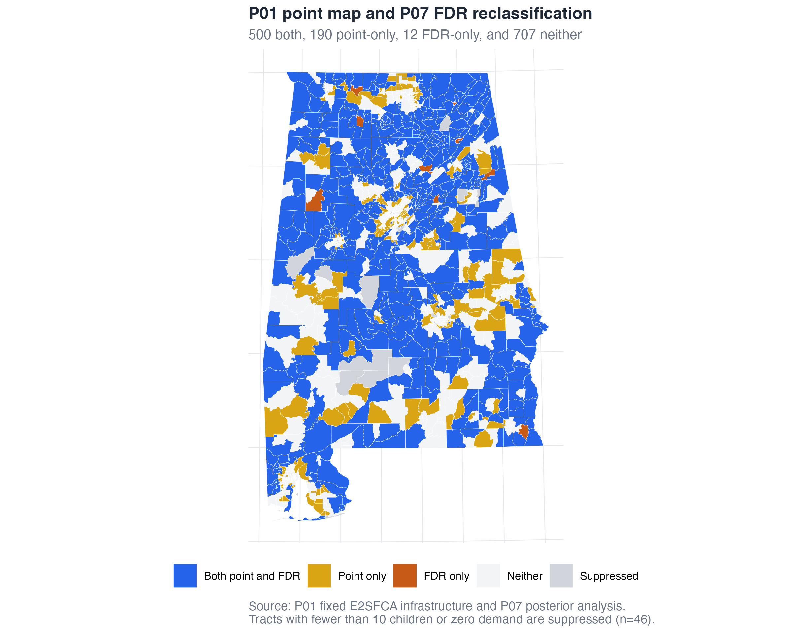
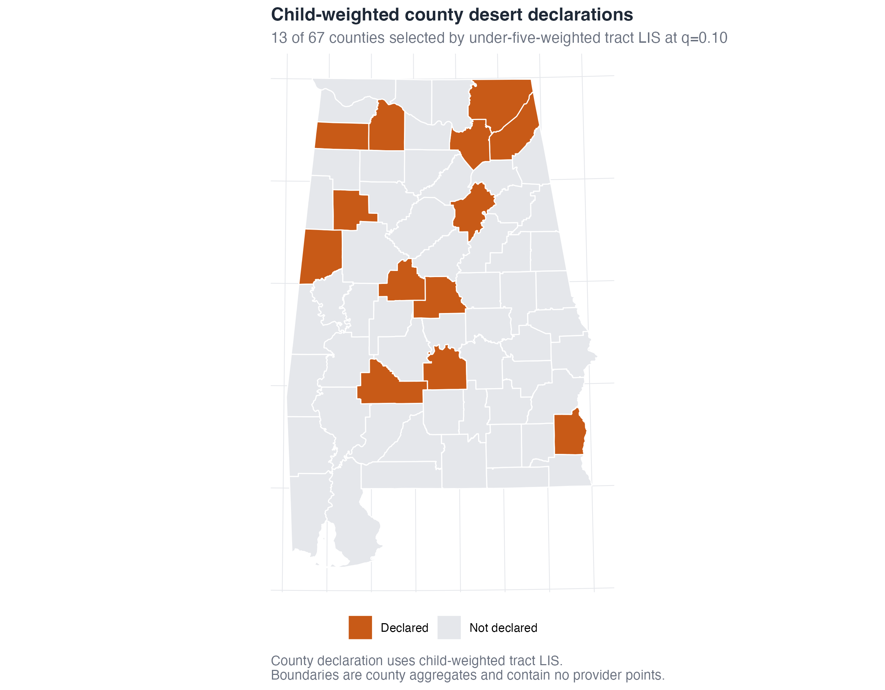
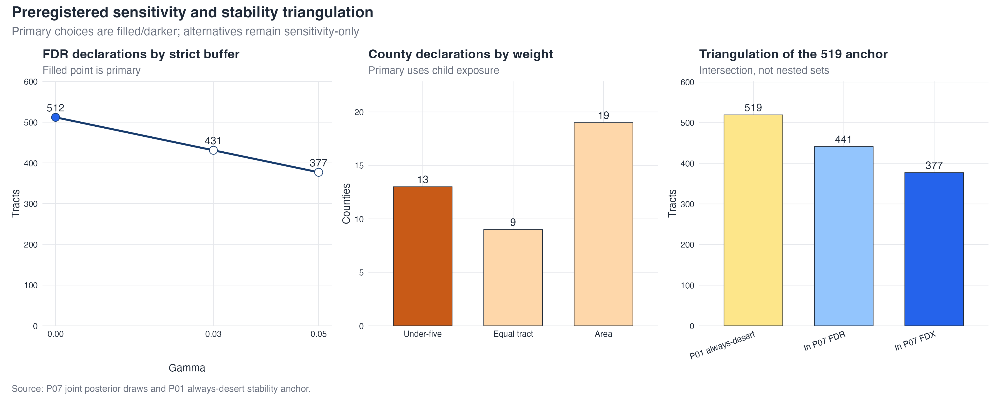

# Reproducing the exhibits {#sec-exhibits}

This chapter tours the paper's exhibits, shows how the disclosure-safe aggregate
layer is built, and walks through rebuilding every figure without any restricted
data (Track C). By the end you can regenerate the maps yourself and check them
against the shipped originals.

## The exhibits

Step 4.1 (`scripts/04-1_visualize.R`) turns the analytic objects into six
figures, three exact-lookup tables, and one aggregate interactive map. Each reads
the single source of truth (`outputs/key_numbers.csv`) and asserts its displayed
values against the registry before writing, so a figure can never silently drift
from the reported numbers.

| Exhibit | What it shows |
|---|---|
| **F1** | Posterior desert probability $p_t=\Pr(\text{coverage}<0.33)$ for every tract (@sec-posterior). |
| **F2** | FDR desert declarations at $q=0.10$, with the deterministic point deserts outlined. |
| **F3** | The stricter FDX headline core. |
| **F4** | Reclassification against the deterministic map (both / point-only / FDR-only / neither). |
| **F5** | Child-weighted county declarations. |
| **F6** | Preregistered sensitivity and the 519-anchor triangulation. |
| **T1–T3** | Declaration summary; the point-vs-FDR cross-classification; the sensitivity summary. |
| leaflet | An aggregate interactive tract choropleth (posterior probability + FDR layers). |

The reclassification map makes the study's central claim visible: it is not that
the deterministic map was wrong, but that its designations carry very different
amounts of evidence.



The county map answers a different, coarser question — which *counties* can be
declared under a child-weighted rule — and it is deliberately conservative: none
of the four large metros is declared.



The robustness panel collects the preregistered alternatives and the stability
triangulation in one place; the primary choices are drawn filled/darker so they
never blur into the sensitivity-only variants.



## The disclosure-safe aggregate layer

Because the analytic objects are derived from confidential records, they are not
shipped. Instead, `scripts/build_derived.R` reduces them to a **disclosure-safe
aggregate layer** in `data/derived/` that carries everything the exhibits need
and nothing that could identify a provider or a small population. It is a
custodian step — only someone holding the protected objects can run it — and it
is the audit trail for how every shipped number was made safe:

- it keeps public ACS demand columns but **blanks every tract-level result for
  the 46 display-suppressed tracts** (zero demand or fewer than 10 children),
  matching the paper's maps;
- it runs a machine-checked guard (`assert_no_pii_columns()`) before writing any
  table, refusing any column that looks like a provider identifier or a
  coordinate; and
- it ships the geometry as a **public, simplified** 2020 Census/TIGER polygon
  layer.

`data/derived/README.md` documents every file. The one behavior to keep in mind:
the aggregate counts in the paper (512 FDR, 412 FDX, 13 counties) *include* the
suppressed tracts — only their per-tract display is withheld — so, for example,
`tract_results.csv` shows 501 non-suppressed FDR declarations (11 declared tracts
fall under the display floor). The authoritative counts live in
`outputs/key_numbers.csv`.

## Track C: rebuild the figures from the aggregate layer

`scripts/reproduce_exhibits.R` reads *only* `data/derived/` and regenerates F1–F6
into `results/figures/`. It needs no restricted data, no Census key, and no INLA
— just a clone and a CRAN-only R stack. Run it from the package root:

```sh
Rscript scripts/reproduce_exhibits.R
```

The script mirrors the figure recipes in `04-1_visualize.R` exactly, joining the
tract result table to the simplified geometry:

```r
geom   <- sf::st_read("data/derived/al_tracts_2020_simplified.geojson")
tracts <- read.csv("data/derived/tract_results.csv",
                   colClasses = c(GEOID = "character", county_fips = "character"))

map_data <- dplyr::left_join(geom, tracts, by = "GEOID") |>
  dplyr::mutate(
    posterior_display = ifelse(display_allowed, desert_probability, NA_real_)
  )
```

The suppressed tracts arrive already blanked (the `display_allowed` flag drives
the same masking the paper uses), so a rebuilt map shows exactly the 46 grey
suppressed tracts the published figure does.

## Comparing your rebuild to the shipped originals

You now have two copies of each figure: the canonical `outputs/figures/` shipped
by the authors, and your `results/figures/` rebuild. They are built from the same
numbers; the only intended difference is that the rebuild uses the **simplified**
public geometry, so tract borders are very slightly coarser at high zoom. If a
rebuilt figure differs in any way that matters — a different count in a subtitle,
a tract in the wrong class — that is a real discrepancy worth chasing, and
@sec-reproducibility shows how the verification script would catch it.

The tables and the interactive map are shipped ready to open: `outputs/tables/`
holds the CSV, LaTeX, and HTML forms of T1–T3, and
`outputs/maps/leaflet_desert_posterior_fdr.html` is a self-contained aggregate
map you can open in any browser.
